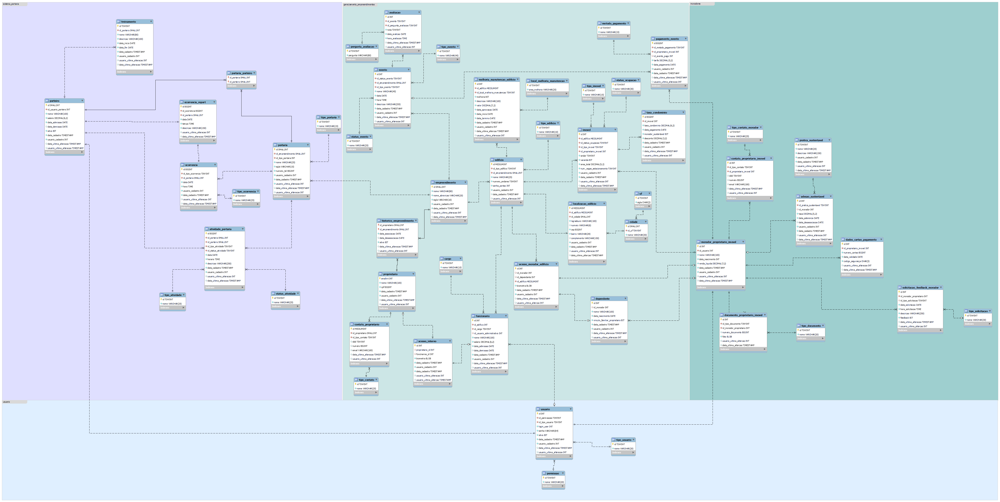

# Modelagem gestao imobiliaria "ImmoLink"
 Repositório que representa modelagem de dados de uma empresa de  gestão imobiliária abrangente, focado em empreendimentos, edifícios, funcionários e moradores. A regra de negócio fictícia aborda alocação de espaços, monitoramento financeiro e comunicação eficiente, buscando otimizar a administração predial para uma experiência integrada e eficaz.

A regra de negocio foi gerada através do chatgpt tendo como base uma consolidada regra de negócio já existente no mercado. 
[regra gerada](https://di0-j4v4.notion.site/ImmoLink-bd0ccfa081254f588f2e684509b1e190?pvs=4)

# Contribuições são bem-vindas!

Olá, Me chamo Adriel e estou aberto a contribuições para melhorar este projeto. Se você encontrar problemas relacionados a modelagem, tipagem ou cardinalidade. Caso surja ideias para novos recursos ou melhorias, ou simplesmente quiser ajudar a aprimorar o projeto, sinta-se à vontade para abrir uma issue.

## Como Contribuir

1. Verifique se já existe uma issue semelhante.
2. Fork o repositório e crie uma branch para sua contribuição.
3. Trabalhe nas alterações e faça commits significativos.
4. Abra um pull request referenciando a issue relevante.
